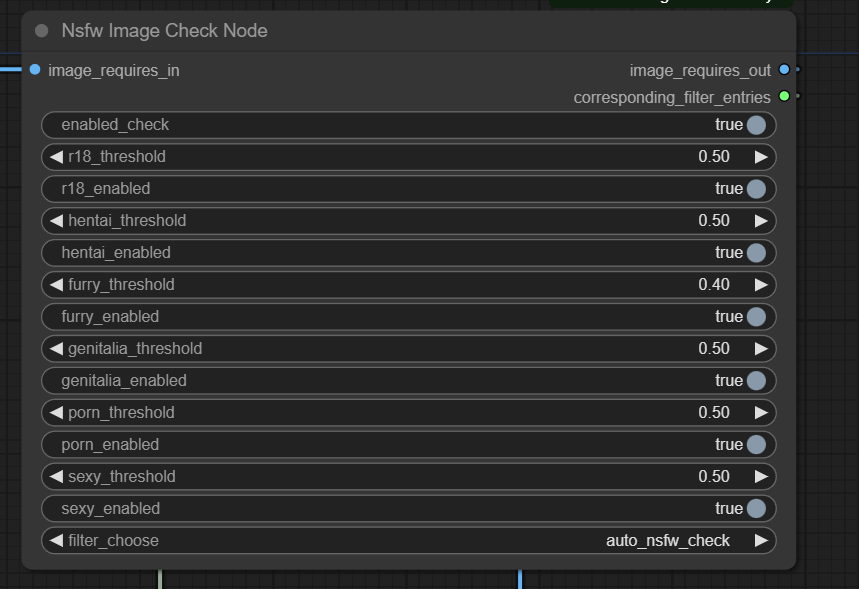

# nsfw-image-check-comfyui使用手册

## 安装
在custom_nodes目录下进行
```
git clone https://github.com/fallingmeteorite/nsfw-image-check-comfyui.git
cd nsfw-image-check-comfyui
pip install -r requirements.txt
```

## 节点介绍
节点名:Nsfw Image Check Node

输入(image_requires_in)为IMAGE

输出(image_requires_out)为IMAGE

输出(corresponding_filter_entries)为STRING


image_requires_in:s输入图.通常接在VAE Decode后面或者load image

image_requires_out:用于输出图片,筛选通过输出原图否则输出警告图

corresponding_filter_entries:用于告诉被触发的特征筛选


## 使用
模型已经预下载完毕,插件无需联网

enabled_check:是否开启检测,默认True

后缀为threshold:触发筛选阈值,越低效果越强,范围(0~1),默认0.5

后缀为enabled:是否开启该特征的检测(在filter_choose为auto的时候生效)

filter_choose:启用的筛选模式,除了auto之外都是单个特征筛选,推荐选择auto

## 引用
插件使用了https://github.com/deepghs/imgutils库

但是由于插件禁用了模型下载等，所以并没有安装这个库，而是修改部分代码直接存放在插件文件夹下

所以在这里写明


