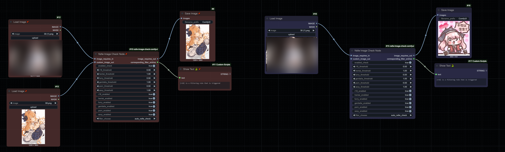

- [English version](./README.md)
- [中文版本](./README_CN.md)

# nsfw-image-check-comfyui

## Installation

```commandline
git clone https://github.com/fallingmeteorite/nsfw-image-check-comfyui.git

cd nsfw-image-check-comfyui

pip install -r requirements.txt

```

or

```commandline
comfy node registry-install nsfw-image-check-comfyui
```

## Node Introduction

Node Name:Nsfw Image Check Node

Block inappropriate content in images and output a warning image



Node Name:Nsfw area coverage

Filter out inappropriate content and output


## Parameter Explanation

`image_requires_in` Input the chart. Usually, VAE decoding or image loading follows.

`image_requires_out` Used for outputting images, filtering can be done by outputting the original image or the warning
image.

`custom_image_out` Custom images used to replace images that trigger detection (optional)

`corresponding_filter_entries` Output the filters triggered by the automatic check mode (optional)

`corresponding_filter_entries`: Used to indicate the filters that have been triggered

`enabled_check`: Enable detection?

`xxxx threshold`: Threshold for triggering detection. The lower the threshold, the stronger the effect, range (0~1)

`xxxx enabled`: Whether to enable this type of detection during the testing period (effective when `filter_choose` is
set to `auto_nsfw_check`)

`filter_choose`: Which filters are enabled when `auto_nsfw_check` is selected will run all filters where `xxxx enabled`
is `True`.

The images you want to replace are placed in the `img` folder, with the file extension `.jpg`, and the file names need
to be changed to sequential numbers.

## Reference library

Libraries used: https://github.com/deepghs/imgutils

Since the plugin disables features such as model downloading, this library is not installed. Some of the modified code
is directly stored in the plugin folder, and the models are pre-downloaded. The plugin does not need to connect to the
internet to be used.
