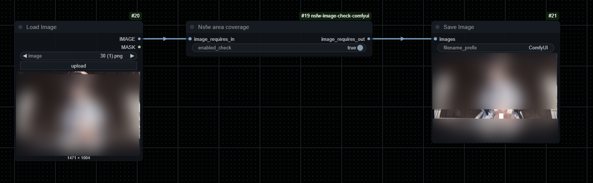

- [English version](./README.md)
- [中文版本](./README_CN.md)

# nsfw-image-check-comfyui

## 安装

```commandline
git clone https://github.com/fallingmeteorite/nsfw-image-check-comfyui.git

cd nsfw-image-check-comfyui

pip install -r requirements.txt

```

或者

```commandline
comfy node registry-install nsfw-image-check-comfyui
```

## 节点介绍

节点名字:Nsfw Image Check Node

屏蔽不适宜内容的图片并输出警告图片


节点名字:Nsfw area coverage

屏蔽不适宜部分内容并输出



## 参数解释

`image_requires_in` 输入图表。通常接着进行 VAE 解码或加载图像

`image_requires_out` 用于输出图片，可通过输出原始图像或输出警告图像进行筛选

`custom_image_out` 自定义图像用于替换触发检测的图像(可选)

`corresponding_filter_entries` 输出自动检查模式触发的过滤器(可选)

`corresponding_filter_entries`: 用于说明已触发的过滤器

`enabled_check`: 是否启用检测

`xxxx threshold`: 触发检测的阈值,阈值越低,效果越强,范围（0~1）

`xxxx enabled`: 是否在测试期间启用此类型的检测(当`filter_choose`设置为`auto_nsfw_check`时有效)

`filter_choose`: 启用什么筛选器当选择为`auto_nsfw_check`会运行所有`xxxx enabled`为`True`的筛选器

想替换的图片放在`img`文件夹中,文件后缀为`.jpg`并且文件名需要更改为按顺序的数字

## 参考库

使用的库: https://github.com/deepghs/imgutils

由于插件禁用了模型下载等功能,因此此库未安装,而部分修改后的代码直接存储在插件文件夹中,模型是预先下载好的,插件不需要连接互联网使用.
